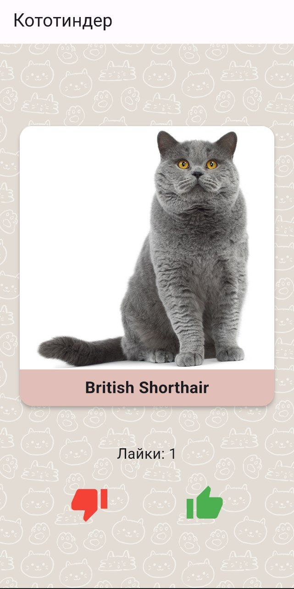
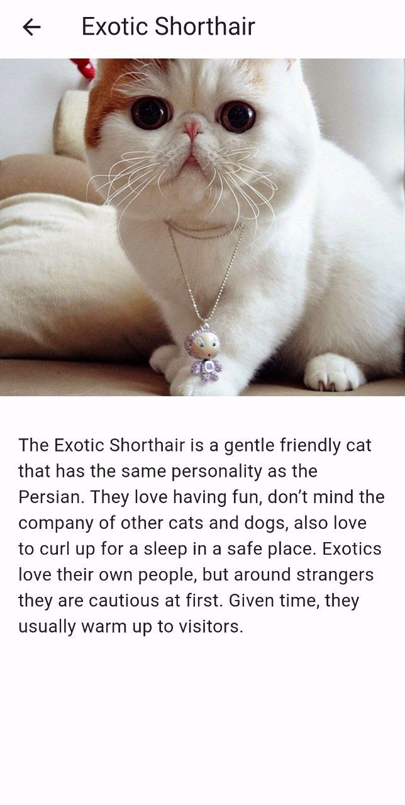

# Catinder

Тиндер котов

## Функционал

1. На главном экране отображается случайное изображение котика и название его породы

2. Изображение котика можно свайпнуть или смахнуть влево или вправо

3. Так же есть две кнопки: лайк/дизлайк

4. Смахивание, свайп или нажатие на кнопку должно сменять котика на нового

5. Если котика лайкнули (лайк или свайп вправо), то на экране должен увеличиваться счетчик

6. Если нажать на само изображение котика, то должен открываться новый экран с детальным описанием

7. На экране детального описания отображается то же изображение котика, плюс отображается вся информация про породу

8. Есть экран лайкнутых котиков, со скроллящимся списком всех лайкнутых котиков. 

9. Экран лайкнутых котиков отображает список с изображением, породой и датой лайка.

10. В списке есть с возможность удаления карточки из списка.

11. Фильтрация по породе работает на экране лайков 

12. При выборе породы в фильтре список обновляется мгновенно.
    
13. При длительной загрузке приложение показывает progress bar.
    
14. При ошибке сети отображается диалог с ошибкой.

Ссылка на скачивание: https://drive.google.com/file/d/12c2qhQr52q2CMF60FZcz8MRQYHwSgYqJ/view?usp=sharing

## Скриншоты

